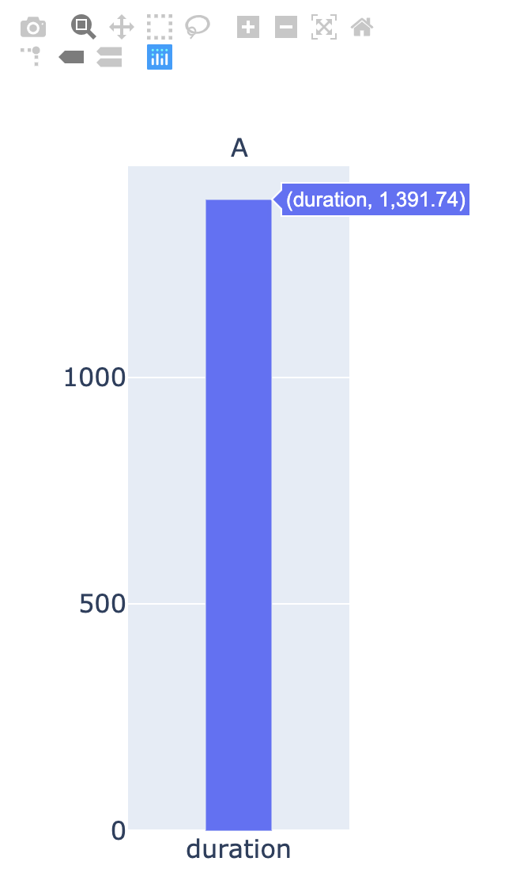

This is part two of a post looking at how to get a site's performance with [Cypress](https://www.cypress.io/) and the [Performance Interface](https://developer.mozilla.org/en-US/docs/Web/API/Performance). Now let's look at how to take that data and visualize it with [Plotly](https://plotly.com/python/).

The Python code to generate a simple Plotly graph is as follows:

```python
import json
from plotly.subplots import make_subplots
import plotly.graph_objects as go

label=['duration']

fig = make_subplots(
    rows=1, cols=1,
    subplot_titles=("API Load Durations"))

with open('../performance/result.json') as f:
    result = json.load(f)

fig.append_trace(go.Bar(x=label, y=result, width=[0.3]), 1, 1)

fig.update_yaxes(tickvals=[0, 500, 1000, 1500, 2000, 2500, 3000, 3500, 4000])
fig.update_layout(showlegend=False, width=300, height=600, font=dict(size=16))
fig.write_html('../plots/first_figure.html', auto_open=True)
```

Next, run the following code in your terminal (replace file.py with the name of your Plotly file):


```bash
python3 file.py
```


You should then get something like this pop up on your monitor:



